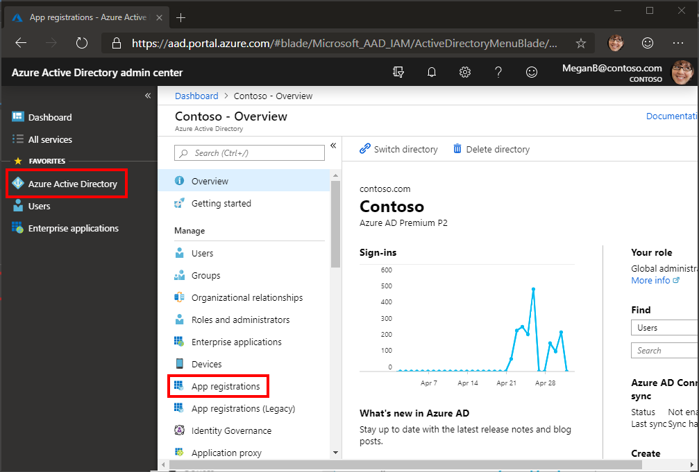
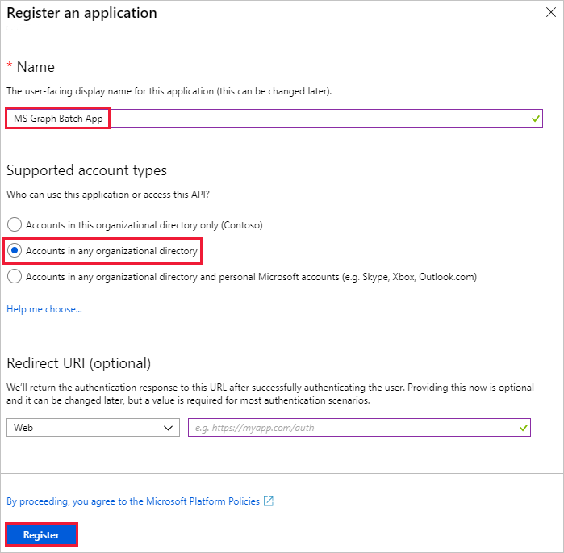
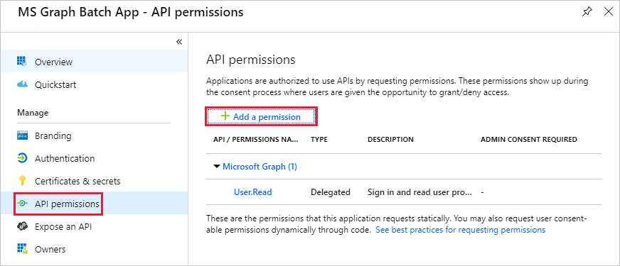
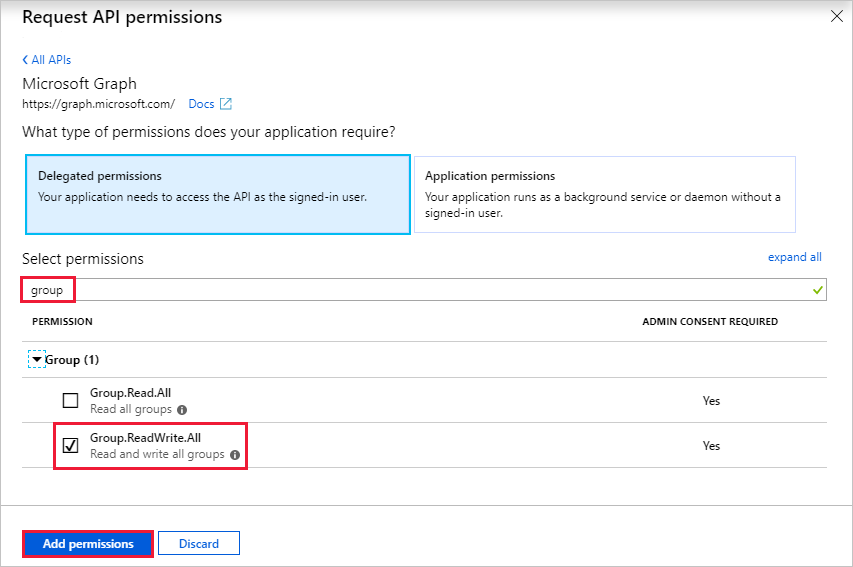
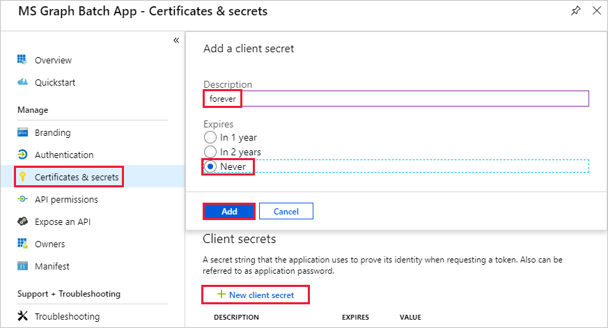
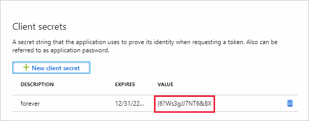

<!-- markdownlint-disable MD002 MD041 -->

In dieser Übung erstellen Sie eine neue Azure Active Directory-Anwendung, die verwendet wird, um die Delegierten Berechtigungen für den benutzerdefinierten Connector bereitzustellen.

Öffnen Sie einen Browser, und navigieren Sie zu [Azure Active Directory Admin Center](https://aad.portal.azure.com). Klicken Sie im linken Navigationsmenü auf den Link **Azure Active Directory** , und wählen Sie dann den Eintrag **App-Registrierungen** im Abschnitt **Manage** des **Azure Active Directory** Blade aus.

Wählen Sie das **neue Registrierungs** Menüelement oben auf dem Blatt **App-Registrierungen** aus.

Geben Sie `MS Graph Batch App` in das Feld **Name** ein. Wählen Sie im Abschnitt **unterstützte Kontotypen** die Option **Konten in einem beliebigen Organisations Verzeichnis**aus. Lassen Sie den Abschnitt **Umleitungs-URI** leer, und wählen Sie **registrieren**aus.

Kopieren Sie auf dem Blatt **MS Graph-Batch-App** die **Anwendungs-ID (Client)**. Sie benötigen diese in der nächsten Übung.

Wählen Sie den Eintrag **API-Berechtigungen** im Abschnitt **Verwalten** des **MS Graph-Batch-App** -Blades aus. Wählen Sie **Hinzufügen einer Berechtigung** unter **API-Berechtigungen**aus.

Wählen Sie im Blade **API-Berechtigungen anfordern** die Option **Microsoft Graph**und dann **Delegierte Berechtigungen**aus. Suchen `group` Sie nach, und wählen Sie dann die Delegierte Berechtigung **alle Gruppen lesen und schreiben** aus. Klicken Sie unten im Blade auf **Berechtigungen hinzufügen** .

 

Wählen Sie den Eintrag **Zertifikate und Geheimnisse** im Abschnitt **Verwalten** des **MS Graph-Batch-App** -Blades aus, und wählen Sie dann **neuer geheimer Client Schlüssel**aus. Geben Sie `forever` in die **Beschreibung** ein, und wählen Sie **nie** unter **Expires**aus. Wählen Sie **Hinzufügen** aus.

Kopieren Sie den Wert für den neuen geheimen Schlüssel. Sie benötigen diese in der nächsten Übung.

> [!IMPORTANT]
> Dieser Schritt ist wichtig, da auf den geheimen Zugriff nach dem Schließen dieses Blades nicht zugegriffen werden kann. Speichern Sie diesen Schlüssel in einem Text-Editor zur Verwendung in bevorstehenden Übungen.

Um die Verwaltung zusätzlicher Dienste zu ermöglichen, die über Microsoft Graph zugänglich sind, einschließlich der Teams-Eigenschaften, müssen Sie zusätzliche, geeignete Bereiche auswählen, um die Verwaltung bestimmter Dienste zu ermöglichen. Um beispielsweise unsere Lösung so zu erweitern, dass OneNote-Notizbücher oder Planner-Pläne, Buckets und Aufgaben erstellt werden, müssen Sie die erforderlichen Berechtigungs Bereiche für die entsprechenden APIs hinzufügen.
