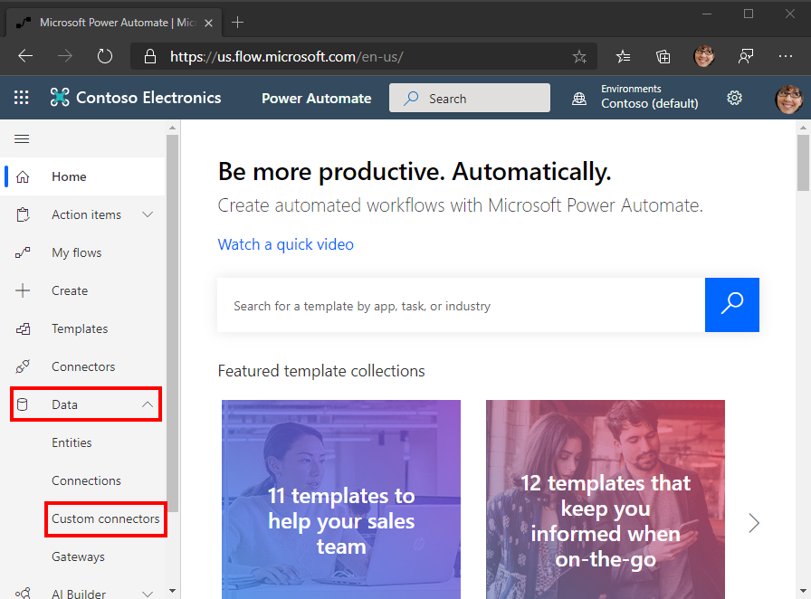
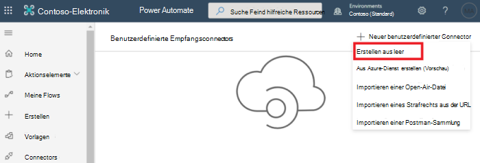
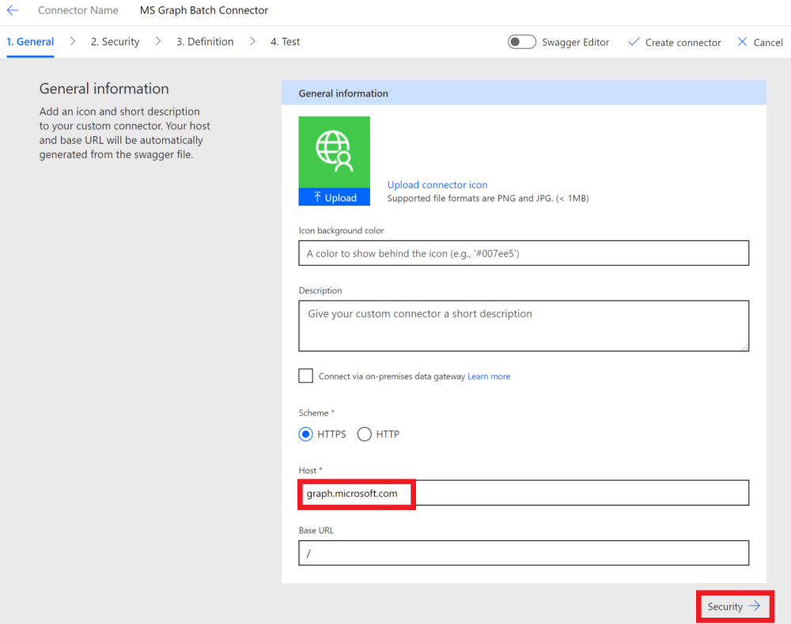
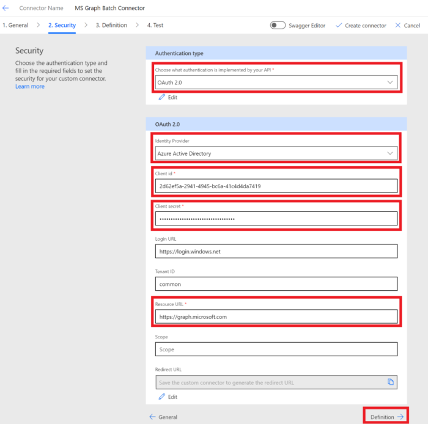
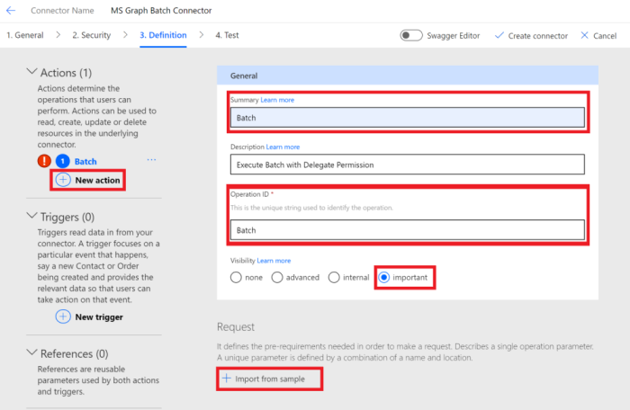
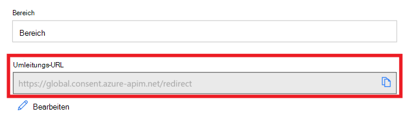
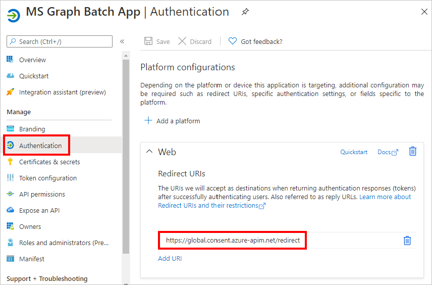

<!-- markdownlint-disable MD002 MD041 -->

In dieser Übung erstellen Sie einen neuen benutzerdefinierten Connector, der in Microsoft Power Automation oder in Azure Logic-Apps verwendet werden kann.In this exercise, you will create a new custom connector which can be used in Microsoft Power Automate or in Azure Logic Apps. Die OpenAPI-Definitionsdatei ist mit dem korrekten Pfad für den Microsoft Graph `$batch` -Endpunkt und zusätzlichen Einstellungen für den einfachen Import vordefiniert.The OpenAPI definition file is prebuilt with the correct path for the Microsoft Graph `$batch` endpoint and additional settings to enable simple import.

Es gibt zwei Optionen zum Erstellen eines benutzerdefinierten Connectors für Microsoft Graph:There are two options to create a custom connector for Microsoft Graph:

- Erstellen aus leerCreate from blank
- Importieren einer OpenAPI-DateiImport an OpenAPI file

## Option 1: Erstellen eines benutzerdefinierten Connectors aus einer leeren VorlageOption 1: Create custom connector from blank template

Öffnen Sie einen Browser, und navigieren Sie zu [Microsoft Power Automation](https://flow.microsoft.com).Open a browser and navigate to [Microsoft Power Automate](https://flow.microsoft.com). Melden Sie sich mit Ihrem Office 365 mandantenadministrator Konto an.Sign in with your Office 365 tenant administrator account. Wählen Sie im linken Menü **Daten** aus, und wählen Sie im Dropdownmenü das Element **benutzerdefinierte Konnektoren** aus.Choose **Data** on the left-hand side menu, and select the **Custom Connectors** item in the drop-down menu.

Klicken Sie auf der Seite **benutzerdefinierte Connectors** auf den Link **neuer benutzerdefinierter Verbinder** in der oberen rechten Ecke, und wählen Sie dann im Dropdownmenü die Option **aus leeres Element erstellen aus** .On the **Custom Connectors** page choose the **New custom connector** link in the top right, then select the **Create from blank** item in the drop-down menu.

Geben Sie `MS Graph Batch Connector` in das Textfeld **Connector Name** ein.Enter `MS Graph Batch Connector` in the **Connector name** text box. Choose **Continue**.Choose **Continue**.

Füllen Sie auf der Seite Connector-Konfigurations **Allgemein** die Felder wie folgt aus.On the connector configuration **General** page, fill in the fields as follows.

- **Schema**: https**Scheme**: HTTPS
- **Host**: `graph.microsoft.com`**Host**: `graph.microsoft.com`
- **Basis-URL**: `/`**Base URL**: `/`

Klicken Sie auf **Sicherheits** Schaltfläche, um fortzufahren.Choose **Security** button to continue.

Füllen Sie auf der Seite **Sicherheit** die Felder wie folgt aus.On the **Security** page, fill in the fields as follows.

- **Wählen Sie aus, welche Authentifizierung von ihrer API implementiert wird**: `OAuth 2.0`**Choose what authentication is implemented by your API**: `OAuth 2.0`
- **Identitätsanbieter**: `Azure Active Directory`**Identity Provider**: `Azure Active Directory`
- **Client-ID**: die Anwendungs-ID, die Sie in der vorherigen Übung erstellt haben**Client id**: the application ID you created in the previous exercise
- **Geheimer Client**Schlüssel: der Schlüssel, den Sie in der vorherigen Übung erstellt haben**Client secret**: the key you created in the previous exercise
- **Anmelde-URL**: `https://login.windows.net`**Login url**: `https://login.windows.net`
- **Mandanten-ID**: `common`**Tenant ID**: `common`
- **Ressourcen-URL**: `https://graph.microsoft.com` (kein Trailing/)**Resource URL**: `https://graph.microsoft.com` (no trailing /)
- **Bereich**: leer lassen**Scope**: Leave blank

Klicken Sie auf die Schaltfläche **Definition** , um fortzufahren.Choose **Definition** button to continue.

Wählen Sie auf der Seite **Definition** die Option **neue Aktion** aus, und füllen Sie die Felder wie folgt aus.On the **Definition** page, select **New Action** and fill in the fields as follows.

- **Zusammenfassung**: `Batch`**Summary**: `Batch`
- **Beschreibung**: `Execute Batch with Delegate Permission`**Description**: `Execute Batch with Delegate Permission`
- **Vorgangs-ID**: `Batch`**Operation ID**: `Batch`
- **Sichtbarkeit**: `important`**Visibility**: `important`

Erstellen Sie eine **Anforderung** durch Auswählen von **Import aus Sample** und füllen Sie die Felder wie folgt aus.Create **Request** by selecting **Import from Sample** and fill in the fields as follows.

- **Verb**: `POST`**Verb**: `POST`
- **URL**: `https://graph.microsoft.com/v1.0/$batch`**URL**: `https://graph.microsoft.com/v1.0/$batch`
- **Kopfzeilen**: leer lassen**Headers**: Leave blank
- **Body**: `{}`**Body**: `{}`

Wählen Sie **Importieren** aus.Select **Import**.

Wählen Sie oben rechts " **Connector erstellen** " aus.Choose **Create Connector** on the top-right. Nachdem der Connector erstellt wurde, kopieren Sie die generierte **Umleitungs-URL** aus der **Sicherheits** Seite.After the connector has been created, copy the generated **Redirect URL** from **Security** page.

Kehren Sie zur registrierten Anwendung im [Azure-Portal](https://aad.portal.azure.com) zurück, das Sie in der vorherigen Übung erstellt haben.Go back to the registered application in the [Azure Portal](https://aad.portal.azure.com) you created in the previous exercise. Wählen Sie im Menü auf der linken Seite **Authentifizierung** aus.Select **Authentication** on the left-hand side menu. Wählen Sie **Plattform hinzufügen** aus, und wählen Sie dann **Web**aus.Select **Add a platform**, then select **Web**. Geben Sie die Umleitungs-URL, die aus dem vorherigen Schritt in den **Umleitungs-URIs**kopiert wurde, dann **configure**ein.Enter the redirect URL copied from the previous step in the **Redirect URIs**, then select **Configure**.

## Option 2: Erstellen eines benutzerdefinierten Connectors durch Importieren der OpenAPI-DateiOption 2: Create custom connector by importing OpenAPI file

Erstellen Sie mithilfe eines Text-Editors eine neue leere Datei mit dem Namen, `MSGraph-Delegate-Batch.swagger.json` und fügen Sie den folgenden Code hinzu.Using a text editor, create a new empty file named `MSGraph-Delegate-Batch.swagger.json` and add the following code.

[!code-json]

Öffnen Sie einen Browser, und navigieren Sie zu [Microsoft Power Automation](https://flow.microsoft.com).Open a browser and navigate to [Microsoft Power Automate](https://flow.microsoft.com). Melden Sie sich mit Ihrem Office 365 mandantenadministrator Konto an.Sign in with your Office 365 tenant administrator account. Wählen Sie im linken Menü **Daten** aus, und wählen Sie im Dropdownmenü das Element **benutzerdefinierte Konnektoren** aus.Choose **Data** on the left-hand side menu, and select the **Custom Connectors** item in the drop-down menu.

Klicken Sie auf der Seite **benutzerdefinierte Connectors** auf den Link **neuer benutzerdefinierter Verbinder** in der oberen rechten Ecke, und wählen Sie dann im Dropdownmenü das Element **OpenAPI-Datei importieren** aus.On the **Custom Connectors** page choose the **New custom connector** link in the top right, then select the **Import an OpenAPI file** item in the drop-down menu.

Geben Sie `MS Graph Batch Connector` in das Textfeld **Connector Name** ein.Enter `MS Graph Batch Connector` in the **Connector name** text box. Wählen Sie das Ordnersymbol aus, um die OpenAPI-Datei hochzuladen.Choose the folder icon to upload the OpenAPI file. Wechseln Sie zu der Datei, die `MSGraph-Delegate-Batch.swagger.json` Sie erstellt haben.Browse to the `MSGraph-Delegate-Batch.swagger.json` file you created. Wählen Sie **weiter** aus, um die OpenAPI-Datei hochzuladen.Choose **Continue** to upload the OpenAPI file.

Klicken Sie auf der Seite Connector-Konfiguration im Navigationsmenü auf den Link **Sicherheit** .On the connector configuration page, choose the **Security** link in the navigation menu. Füllen Sie die Felder wie folgt aus.Fill in the fields as follows.

- **Wählen Sie aus, welche Authentifizierung von ihrer API implementiert wird**: `OAuth 2.0`**Choose what authentication is implemented by your API**: `OAuth 2.0`
- **Identitätsanbieter**: `Azure Active Directory`**Identity Provider**: `Azure Active Directory`
- **Client-ID**: die Anwendungs-ID, die Sie in der vorherigen Übung erstellt haben**Client id**: the application ID you created in the previous exercise
- **Geheimer Client**Schlüssel: der Schlüssel, den Sie in der vorherigen Übung erstellt haben**Client secret**: the key you created in the previous exercise
- **Anmelde-URL**: `https://login.windows.net`**Login url**: `https://login.windows.net`
- **Mandanten-ID**: `common`**Tenant ID**: `common`
- **Ressourcen-URL**: `https://graph.microsoft.com` (kein Trailing/)**Resource URL**: `https://graph.microsoft.com` (no trailing /)
- **Bereich**: leer lassen**Scope**: Leave blank

Wählen Sie oben rechts " **Connector erstellen** " aus.Choose **Create Connector** on the top-right. Nachdem der Connector erstellt wurde, kopieren Sie die generierte **Umleitungs-URL**.After the connector has been created, copy the generated **Redirect URL**.

Kehren Sie zur registrierten Anwendung im [Azure-Portal](https://aad.portal.azure.com) zurück, das Sie in der vorherigen Übung erstellt haben.Go back to the registered application in the [Azure Portal](https://aad.portal.azure.com) you created in the previous exercise. Wählen Sie im Menü auf der linken Seite **Authentifizierung** aus.Select **Authentication** on the left-hand side menu. Wählen Sie **Plattform hinzufügen** aus, und wählen Sie dann **Web**aus.Select **Add a platform**, then select **Web**. Geben Sie die Umleitungs-URL, die aus dem vorherigen Schritt in den **Umleitungs-URIs**kopiert wurde, dann **configure**ein.Enter the redirect URL copied from the previous step in the **Redirect URIs**, then select **Configure**.

