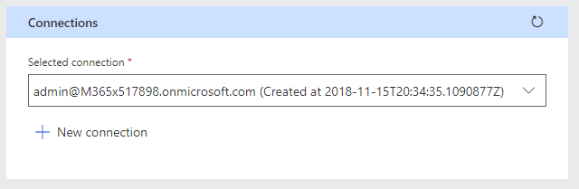

<!-- markdownlint-disable MD002 MD041 -->

Der letzte Konfigurationsschritt, um sicherzustellen, dass der Connector einsatzbereit ist, ist das Autorisieren und Testen des benutzerdefinierten Connectors zum Erstellen einer zwischengespeicherten Verbindung.

> [!IMPORTANT]
> Für die folgenden Schritte müssen Sie mit Administratorrechten angemeldet sein.

Wechseln Sie in [Microsoft Flow](https://flow.microsoft.com)zum Bildschirm Connector-Konfiguration, und wählen Sie im Navigationsmenü den Link **Test** aus. Wählen Sie den Link **neue Verbindung** aus. Melden Sie sich mit dem Azure Active Directory-Konto Ihres Office 365-Mandanten Administrators an.

Wenn Sie zur Eingabe der erforderlichen Berechtigungen aufgefordert werden, überprüfen Sie die **Einwilligung im Namen Ihrer Organisation** , und wählen Sie dann **annehmen** aus, um Berechtigungen zu autorisieren.

Nachdem Sie die Berechtigungen autorisiert haben, wird eine Verbindung in Flow erstellt.

Der benutzerdefinierte Connector ist jetzt konfiguriert und aktiviert. Es kann eine Verzögerung bei der Anwendung und Verfügbarkeit von Berechtigungen geben, aber der Connector ist jetzt konfiguriert.