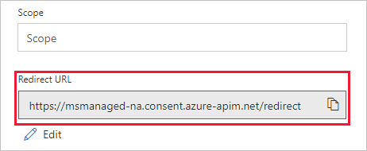

<!-- markdownlint-disable MD002 MD041 -->

In dieser Übung erstellen Sie einen neuen benutzerdefinierten Connector, der in Flow oder in Azure Logic-Apps verwendet werden kann. Die Definitionsdatei für die Open-API ist mit dem korrekten Pfad für den `$batch` Microsoft Graph-Endpunkt und zusätzlichen Einstellungen für den einfachen Import vordefiniert.

Erstellen Sie mit einem Text-Editor eine neue leere Datei `MSGraph-Delegate-Batch.swagger.json` mit dem Namen, und fügen Sie den folgenden Code hinzu.

[!code-json]

Öffnen Sie einen Browser, und navigieren Sie zu [Microsoft Flow](https://flow.microsoft.com). Melden Sie sich mit Ihrem Office 365-mandantenadministrator Konto an. Klicken Sie oben rechts auf das Zahnradsymbol, und wählen Sie im Dropdownmenü das Element **benutzerdefinierte Verbinder** aus.

Wählen Sie auf der Seite **benutzerdefinierte Connectors** den Link **benutzerdefinierten Verbinder erstellen** oben rechts aus, und wählen Sie dann im Dropdownmenü das Element **eine geöffnete API-Datei importieren** aus.

 

Geben `MS Graph Batch Connector` Sie in das Textfeld **benutzerdefinierter Connectorname** ein. Klicken Sie auf das Ordnersymbol, um die geöffnete API-Datei hochzuladen. Navigieren Sie zu `MSGraph-Delegate-Batch.swagger.json` der Datei, die Sie erstellt haben. Wählen Sie **weiter** , um die offene API-Datei hochzuladen.

 

Klicken Sie auf der Seite Connector-Konfiguration im Navigationsmenü auf den Link **Sicherheit** . Füllen Sie die Felder wie folgt aus.

- **Wählen Sie aus, welche Authentifizierung von ihrer API implementiert wird**:`OAuth 2.0`
- **Identitätsanbieter**:`Azure Active Directory`
- **Client-ID**: die Anwendungs-ID, die Sie in der vorherigen Übung erstellt haben
- **Geheimer Client**Schlüssel: die Taste, die Sie in der vorherigen Übung erstellt haben
- **Anmelde-URL**:`https://login.windows.net`
- **Mandanten-ID**:`common`
- **Ressourcen**-URL `https://graph.microsoft.com` : (keine Nachverfolgung/)
- **Bereich**: leer lassen

Klicken Sie oben rechts auf **Verbinder erstellen** .

Kopieren Sie nach der Erstellung des Connectors die generierte Umleitungs- **URL**.

Kehren Sie zur registrierten Anwendung im [Azure-Portal](https://aad.portal.azure.com) zurück, das Sie in der vorherigen Übung erstellt haben. Wählen Sie im **Microsoft Graph-Batch-App** -Blatt **Übersicht** aus, und wählen Sie dann einen Umleitungs- **URI hinzufügen**aus. Fügen Sie im Feld Umleitungs- **URI** die kopierte Umleitungs- **URL** hinzu, und wählen Sie **Speichern**aus.

