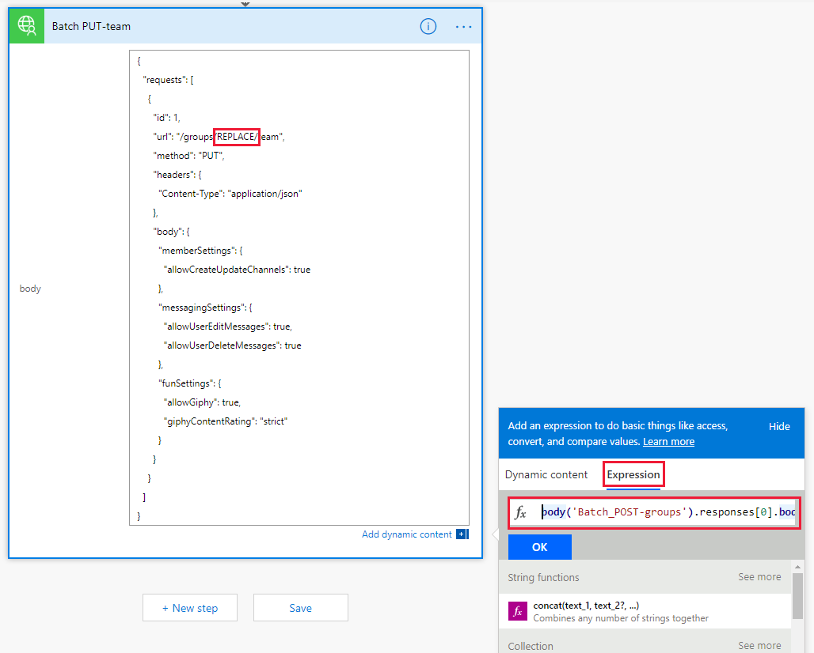
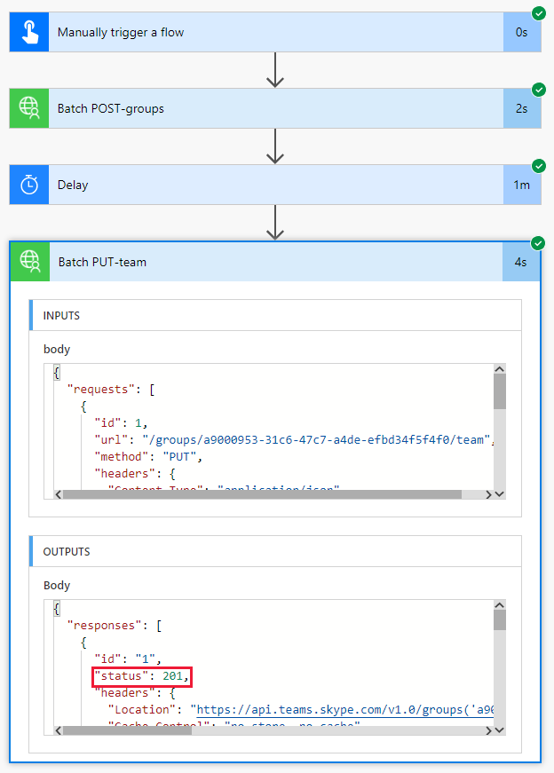

<!-- markdownlint-disable MD002 MD041 -->

In dieser Übung erstellen Sie einen Fluss zur Verwendung des benutzerdefinierten Konnektors, den Sie in den vorherigen Übungen erstellt haben, um ein Microsoft-Team zu erstellen und zu konfigurieren. Der Fluss verwendet den benutzerdefinierten Connector, um eine POST-Anforderung zum Erstellen einer einheitlichen Office 365-Gruppe zu senden, hält während der Gruppenerstellung eine Verzögerung an und sendet dann eine PUT-Anforderung, um die Gruppe einem Microsoft-Team zuzuordnen.

Am Ende sieht ihr Ablauf wie in der folgenden Abbildung aus:


Öffnen Sie [Microsoft Flow](https://flow.microsoft.com) in Ihrem Browser, und melden Sie sich mit ihrem Office 365-mandantenadministrator Konto an. Wählen Sie **meine Flows** in der linken Navigationsleiste aus. Wählen Sie **neu**, und erstellen Sie dann **aus leer**. Wählen Sie **Create from Blank aus**. Geben `Manual` Sie in das Suchfeld ein, und fügen Sie den Trigger **manuell Trigger a Flow** hinzu.

Wählen Sie Add a Input aus, wählen Sie `Name` **Text** aus, und geben Sie als Titel **ein**.


Wählen Sie **neuer Schritt** aus `Batch` , und geben Sie in das Suchfeld ein. Fügen Sie die Batch-Konnektor-Aktion **MS Graph** hinzu. Wählen Sie die Auslassungspunkte aus, `Batch POST-groups`und benennen Sie diese Aktion in um.

Fügen Sie den folgenden Code in **** das Textfeld Text der Aktion ein.

```json
{
  "requests": [
    {
      "url": "/groups",
      "method": "POST",
      "id": 1,
      "headers": { "Content-Type": "application/json" },
      "body": {
        "description": "REPLACE",
        "displayName": "REPLACE",
        "groupTypes": ["Unified"],
        "mailEnabled": true,
        "mailNickname": "REPLACE",
        "securityEnabled": false
      }
    }
  ]
}
```

Ersetzen Sie `REPLACE` die einzelnen Platzhalter `Name` , indem Sie im Menü dynamischer **Inhalt hinzufügen** den Wert aus dem manuellen Trigger auswählen.


Wählen Sie **neuer Schritt**, suchen `delay` Sie nach und fügen Sie eine **Verzögerungs** Aktion hinzu, und konfigurieren Sie Sie für 1 Minute.

Wählen Sie **neuer Schritt** aus `Batch` , und geben Sie in das Suchfeld ein. Fügen Sie die Batch-Konnektor-Aktion **MS Graph** hinzu. Wählen Sie die Auslassungspunkte aus, `Batch PUT-team`und benennen Sie diese Aktion in um.

Fügen Sie den folgenden Code in **** das Textfeld Text der Aktion ein.

```json
{
  "requests": [
    {
      "id": 1,
      "url": "/groups/REPLACE/team",
      "method": "PUT",
      "headers": {
        "Content-Type": "application/json"
      },
      "body": {
        "memberSettings": {
          "allowCreateUpdateChannels": true
        },
        "messagingSettings": {
          "allowUserEditMessages": true,
          "allowUserDeleteMessages": true
        },
        "funSettings": {
          "allowGiphy": true,
          "giphyContentRating": "strict"
        }
      }
    }
  ]
}
```

Wählen Sie `REPLACE` den Platzhalter aus, und wählen Sie dann im dynamischen Inhaltsbereich **Ausdruck** aus. Fügen Sie die folgende Formel in den **Ausdruck**ein.

```js
body('Batch_POST-groups').responses[0].body.id
```



Diese Formel gibt an, dass die Gruppen-ID aus dem Ergebnis der ersten Aktion verwendet werden soll.


Wählen Sie **Speichern**und dann Flow aus, und wählen Sie **Test** aus, um den Fluss auszuführen.

> [!TIP]
> Wenn Sie einen Fehler wie `The template validation failed: 'The action(s) 'Batch_POST-groups' referenced by 'inputs' in action 'Batch_2' are not defined in the template'`erhalten, ist der Ausdruck falsch und wahrscheinlich verweist auf eine Fluss Aktion, die nicht gefunden werden kann. Stellen Sie sicher, dass der Name der Aktion, auf die Sie verweisen, genau übereinstimmt.

Wählen Sie das Optionsfeld **Ich werde die Aktion Auslöser ausführen** , und wählen Sie **& testen**. Klicken Sie im Dialogfeld auf **weiter** . Geben Sie einen Namen ohne Leerzeichen, und wählen Sie **Flow ausführen** , um ein Team zu erstellen.


Klicken Sie abschließend auf den Link **Fluss Laufaktivität anzeigen** , und wählen Sie dann den laufenden Ablauf aus, um das Aktivitätsprotokoll anzuzeigen.

> [!NOTE]
> Möglicherweise müssen Sie auf die laufende Fluss Instanz in der Liste Verlauf ausführen klicken, um die Ausführung des Flows anzuzeigen.

Nach Abschluss des Ablaufs wurden Ihre Office 365-Gruppe und Ihr Team konfiguriert. Wählen Sie die Batch Aktionselemente aus, um die Ergebnisse der JSON-Batch Aufrufe anzuzeigen. Die `outputs` der `Batch PUT-team` Aktion sollte den Statuscode 201 für eine erfolgreiche Team Zuordnung aufweisen, die dem folgenden Bild ähnelt.

