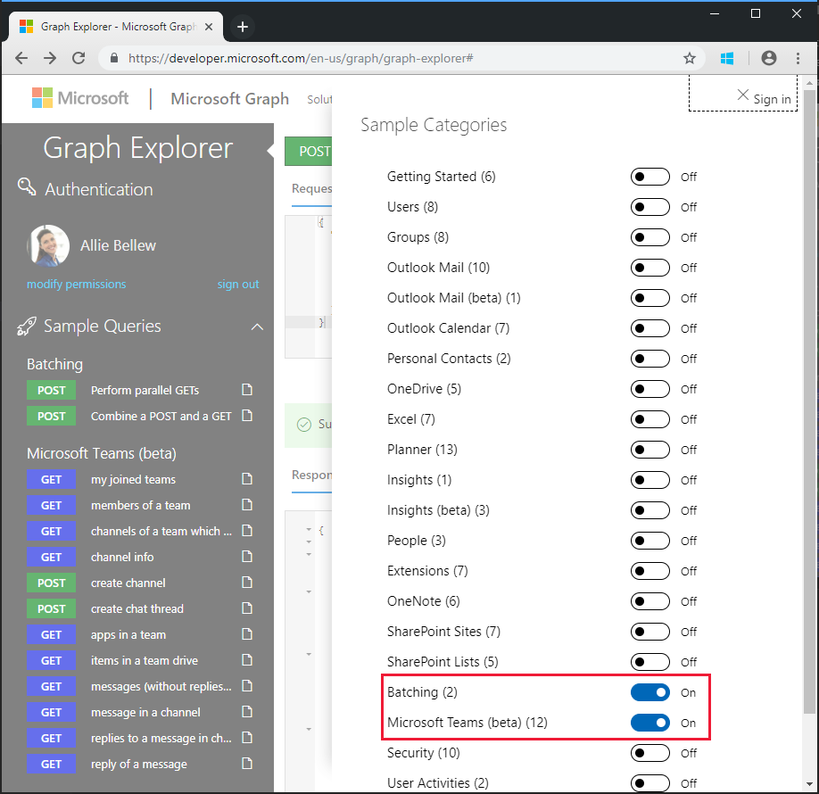
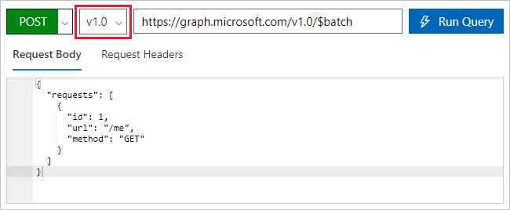
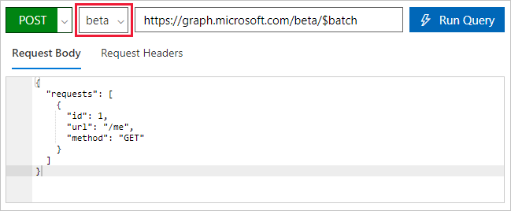

<!-- markdownlint-disable MD002 MD041 -->

Bevor Sie einen Fluss zur Nutzung des neuen Connectors erstellen, verwenden Sie [Microsoft Graph-Explorer](https://developer.microsoft.com/graph/graph-explorer) , um einige der Funktionen und Features der JSON-Batchverarbeitung in Microsoft Graph zu erkennen.

Öffnen Sie den [Microsoft Graph-Explorer](https://developer.microsoft.com/graph/graph-explorer) in Ihrem Browser. Melden Sie sich mit Ihrem Office 365-mandantenadministrator Konto an. Klicken Sie im linken Navigationsbereich auf den Link **Weitere Beispiele anzeigen** , und schalten Sie die Beispiele für **Batchverarbeitung** und **Microsoft Teams (Beta)** auf **ein**.



Wählen Sie im linken Menü die Option **parallele abrufen** -Beispielabfrage ausführen aus. Klicken Sie oben rechts auf dem Bildschirm auf die Schaltfläche **Abfrage ausführen** .

Bei dem Beispiel Batchvorgang werden drei HTTP GET-Anforderungen Batches und ein einzelner HTTP- `/v1.0/$batch` Beitrag an den Graph-Endpunkt ausgegeben.

```json
{
  "requests": [
    {
      "url": "/me?$select=displayName,jobTitle,userPrincipalName",
      "method": "GET",
      "id": "1"
    },
    {
      "url": "/me/messages?$filter=importance eq 'high'&$select=from,subject,receivedDateTime,bodyPreview",
      "method": "GET",
      "id": "2"
    },
    {
      "url": "/me/events",
      "method": "GET",
      "id": "3"
    }
  ]
}
```

Die zurückgegebene Antwort wird unten gezeigt. Beachten Sie das Array der Antworten, die von Microsoft Graph zurückgegeben werden. Die Antworten auf die Batchanforderungen werden möglicherweise in einer anderen Reihenfolge als die Reihenfolge der Anforderungen im Beitrag angezeigt. Die `id` -Eigenschaft sollte verwendet werden, um einzelne Batchanforderungen mit bestimmten Batch Antworten zu korrelieren.

> [!NOTE]
> Die Antwort wurde zur Lesbarkeit gekürzt.

```json
{
  "responses": [
    {
      "id": "1",
      "status": 200,
      "headers": {...},
      "body": {...}
    },
    {
      "id": "3",
      "status": 200,
      "headers": {...},
      "body": {...}
    }
    {
      "id": "2",
      "status": 200,
      "headers": {...},
      "body": {...}
    }
  ]
}
```

Jede Antwort enthält eine `id`, `status` `headers`, und `body` -Eigenschaft. Wenn die `status` Eigenschaft für eine Anforderung einen Fehler angibt, `body` enthält Sie alle Fehlerinformationen, die von der Anforderung zurückgegeben werden.

Um eine Reihenfolge der Vorgänge für die Anforderungen sicherzustellen, können einzelne Anforderungen mit der [dependsOn](https://docs.microsoft.com/graph/json-batching#sequencing-requests-with-the-dependson-property) -Eigenschaft sequenziert werden.

Zusätzlich zu Sequenzierung und Abhängigkeits Operationen nimmt die JSON-Batchverarbeitung einen Basis Pfad an und führt die Anforderungen von einem relativen Pfad aus. Jedes Batch Anforderungselement wird entweder von den `/v1.0/$batch` oder `/beta/$batch` Endpunkten gemäß der angegebenen ausgeführt. Dies kann erhebliche Unterschiede aufweisen `/beta` , da der Endpunkt zusätzliche Ausgaben zurückgeben kann, die möglich `/v1.0` erweise nicht im Endpunkt zurückgegeben werden.

Führen Sie beispielsweise die folgenden beiden Abfragen im [Microsoft Graph-Explorer](https://developer.microsoft.com/graph/graph-explorer)aus.

1. Abfragen des `/v1.0/$batch` Endpunkts mithilfe `/me` der URL (kopieren und Einfügen von unten).

```json
{
  "requests": [
    {
      "id": 1,
      "url": "/me",
      "method": "GET"
    }
  ]
}
```



Verwenden Sie jetzt das Dropdown-Listenfeld Versionsauswahl, um `beta` zum Endpunkt zu wechseln, und stellen Sie genau dieselbe Anforderung.



Was sind die Unterschiede in den zurückgegebenen Ergebnissen? Probieren Sie einige andere Abfragen aus, um einige der Unterschiede zu identifizieren.

Neben unterschiedlichen Antwort Inhalten vom `/v1.0` und- `/beta` Endpunkten ist es wichtig, die möglichen Fehler zu verstehen, wenn eine Batchanforderung ausgeführt wird, für die keine Genehmigung erteilt wurde. Beispielsweise ist Folgendes ein Batch Anforderungselement zum Erstellen eines OneNote-Notizbuchs.

```json
{
  "id": 1,
  "url": "/groups/65c5ecf9-3311-449c-9904-29a2c76b9a50/onenote/notebooks",
  "headers": {
    "Content-Type": "application/json"
  },
  "method": "POST",
  "body": {
    "displayName": "Meeting Notes"
  }
}
```

Wenn die Berechtigungen zum Erstellen von OneNote-Notizbüchern jedoch nicht erteilt wurden, wird die folgende Antwort empfangen. Hinweis der Statuscode `403 (Forbidden)` und die Fehlermeldung, die angibt, dass das angegebene OAuth-Token nicht die für die angeforderte Aktion erforderlichen Bereiche enthält.

```json
{
  "responses": [
    {
      "id": "1",
      "status": 403,
      "headers": {
        "Cache-Control": "no-cache"
      },
      "body": {
        "error": {
          "code": "40004",
          "message": "The OAuth token provided does not have the necessary scopes to complete the request.
            Please make sure you are including one or more of the following scopes: Notes.ReadWrite.All,
            Notes.Read.All (you provided these scopes: Group.Read.All,Group.ReadWrite.All,User.Read,User.Read.All)",
          "innerError": {
            "request-id": "92d50317-aa06-4bd7-b908-c85ee4eff0e9",
            "date": "2018-10-17T02:01:10"
          }
        }
      }
    }
  ]
}
```

Jede Anforderung in Ihrem Batch gibt einen Statuscode und Ergebnisse oder Fehlerinformationen zurück. Sie müssen jede der Antworten verarbeiten, um den Erfolg oder das Fehlschlagen der einzelnen Batchvorgänge zu ermitteln.