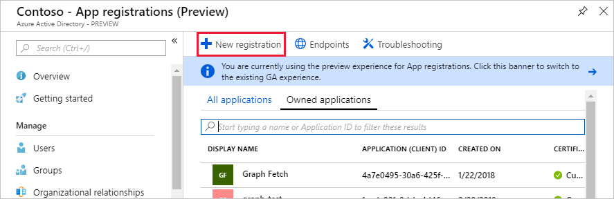
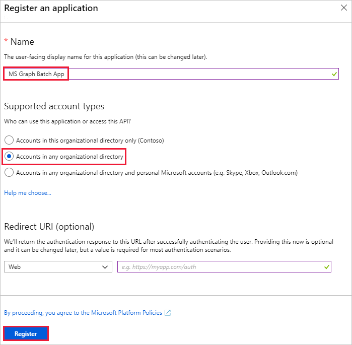

<!-- markdownlint-disable MD002 MD041 -->

In dieser Übung erstellen Sie eine neue Azure Active Directory-Anwendung, die zum Bereitstellen der Delegierten Berechtigungen für den benutzerdefinierten Connector verwendet wird.In this exercise, you will create a new Azure Active Directory Application which will be used to provide the delegated permissions for the custom connector.

Öffnen Sie einen Browser, und navigieren Sie zu [Azure Active Directory Admin Center](https://aad.portal.azure.com).Open a browser and navigate to [Azure Active Directory admin center](https://aad.portal.azure.com). Klicken Sie im linken Navigationsmenü auf den Link **Azure Active Directory** , und wählen Sie dann im Abschnitt **Verwalten** des **Azure Active Directory** -Blades den Eintrag **App Registrations** aus.Choose the **Azure Active Directory** link in the left navigation menu, then choose the **App registrations** entry in the **Manage** section of the **Azure Active Directory** blade.

Wählen Sie das Menüelement **neue Registrierung** oben auf dem Blatt **App** -Registrierungen aus.Choose the **New registration** menu item at the top of the **App Registrations** blade.

Geben `MS Graph Batch App` Sie in das Feld **Name** ein.Enter `MS Graph Batch App` in the **Name** field. Wählen Sie im Abschnitt **unterstützte Kontotypen** **Konten in einem beliebigen Organisations Verzeichnis**aus.In the **Supported account types** section, select **Accounts in any organizational directory**. Lassen Sie den Abschnitt Umleitungs- **URI** leer, und wählen Sie **registrieren**.Leave the **Redirect URI** section blank and choose **Register**.

Kopieren Sie auf dem Blade- **Batch-APP von MS Graph** die **Anwendungs-ID (Client)**.On the **MS Graph Batch App** blade, copy the **Application (client) ID**. Sie benötigen dies in der nächsten Übung.You'll need this in the next exercise.

Wählen Sie den Eintrag **API-Berechtigungen** im Abschnitt **Verwalten** des Batch-App-Blatts **MS Graph** aus.Choose the **API permissions** entry in the **Manage** section of the **MS Graph Batch App** blade. Wählen Sie **Berechtigung hinzufügen** unter **API-Berechtigungen**aus.Choose **Add a permission** under **API permissions**.

Klicken Sie im Blatt **API-Berechtigungen anfordern** auf **Microsoft Graph**, und wählen Sie dann **Delegierte Berechtigungen**aus.In the **Request API permissions** blade, choose the **Microsoft Graph**, then choose **Delegated permissions**. Suchen `group`, und wählen Sie dann die Berechtigung **alle Gruppen mit Berechtigungen Lesen und schreiben** aus.Search for `group`, then select the **Read and write all groups** delegated permission. Wählen Sie am unteren Rand des Blades **Berechtigungen hinzufügen** aus.Choose **Add permissions** at the bottom of the blade.

 

Wählen Sie den Eintrag **Zertifikate und** geheimen im Abschnitt **Verwalten** des Batch-App-Blatts **MS Graph** aus, und wählen Sie dann **neuer Client Schlüssel**aus.Choose the **Certificates and secrets** entry in the **Manage** section of the **MS Graph Batch App** blade, then choose **New client secret**. Geben `forever` Sie in die **Beschreibung** ein, und wählen Sie **nie** unter **Expires**aus.Enter `forever` in the **Description** and select **Never** under **Expires**. Wählen Sie **Hinzufügen** aus.Choose **Add**.

Kopieren Sie den Schlüsselwert für den neuen Schlüssel.Copy the key value for the new key. Sie benötigen dies in der nächsten Übung.You'll need this in the next exercise.

> [!IMPORTANT]
> Dieser Schritt ist wichtig, da der Schlüssel nicht zugegriffen werden kann, nachdem Sie dieses Blade geschlossen haben.This step is critical as the key will not be accessible once you close this blade. Speichern Sie diesen Schlüssel in einem Text-Editor für die nächsten Übungen.Save this key to a text editor for use in upcoming exercises.

Um die Verwaltung zusätzlicher Dienste, auf die über Microsoft Graph zugegriffen werden kann, einschließlich der Teams-Eigenschaften, zu ermöglichen, müssen Sie zusätzliche, geeignete Bereiche auswählen, um die Verwaltung bestimmter Dienste zu ermöglichen.To enable management of additional services accessible via the Microsoft Graph, including Teams properties, you would need to select additional, appropriate scopes to enable managing specific services. Wenn Sie beispielsweise unsere Lösung erweitern möchten, um die Erstellung von OneNote-Notizbüchern oder Plan Plänen, Buckets und Aufgaben zu ermöglichen, müssen Sie die erforderlichen Berechtigungs Bereiche für die relevanten APIs hinzufügen.For example, to extend our solution to enable creating OneNote Notebooks or Planner plans, buckets and tasks you would need to add the required permission scopes for the relevant APIs.