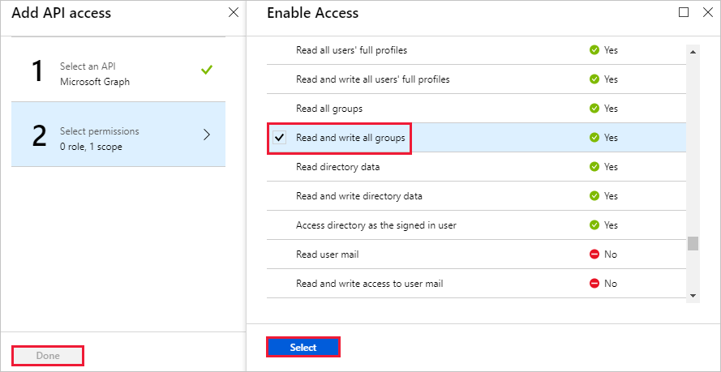

<!-- markdownlint-disable MD002 MD041 -->

In dieser Übung erstellen Sie eine neue Azure Active Directory-Anwendung, die zum Bereitstellen der Delegierten Berechtigungen für den benutzerdefinierten Connector verwendet wird.

Öffnen Sie einen Browser, und navigieren Sie zu [Azure Active Directory Admin Center](https://aad.portal.azure.com). Klicken Sie im linken Navigationsmenü auf den Link **Azure Active Directory** , und wählen Sie dann im Abschnitt **Verwalten** des **Azure Active Directory** -Blades den Eintrag **App Registrations** aus.

Wählen Sie das Menüelement **neue Anwendungsregistrierung** oben auf dem Blatt **App** -Registrierungen aus.

Geben `MS Graph Batch App` Sie in das Feld **Name** und `https://localhost.com/$batch` im Feld **Anmelde-URL** ein, und wählen Sie **Erstellen**aus.

Kopieren Sie auf der Seite **MS Graph-Batch-App** die **Anwendungs-ID** der Anwendung. Sie benötigen dies in der nächsten Übung.

Wählen Sie die **Einstellungen** Gear unter dem Anwendungsnamen aus, und wählen Sie dann im Blade Einstellungen das Menüelement **erforderliche Berechtigungen** aus. Wählen Sie oben auf dem Blatt **erforderliche Berechtigungen** die Option **Hinzufügen** aus.

Wählen Sie die Option **Wählen Sie eine API** aus, und wählen Sie dann das Element **Microsoft Graph** aus, und wählen **Sie** am unteren Rand des Blades auswählen aus. ****

Führen Sie auf dem Blatt **Zugriffs Zugriff aktivieren** einen Bildlauf nach unten zum Abschnitt **Delegierte Berechtigungen** aus. Wählen Sie die Berechtigung **alle Gruppen mit Berechtigungen Lesen und schreiben** aus, und wählen Sie dann am unteren Rand des Blades die **Option auswählen** aus. Wählen Sie am unteren Rand des **Add-API-Zugriffs** Blatts **done** aus.

 

Wählen Sie das Menüelement **Schlüssel** auf dem Blatt **Einstellungen** aus. Geben `forever` Sie in die **Schlüssel Beschreibung** ein, und wählen Sie **nie abläuft** aus dem Dropdownmenü **Dauer** aus. Klicken Sie oben im Blade- **Schlüssel** auf **Speichern** . Kopieren Sie den Schlüsselwert für den neuen Schlüssel. Sie benötigen dies in der nächsten Übung.

> [!IMPORTANT]
> Dieser Schritt ist wichtig, da der Schlüssel nicht zugegriffen werden kann, nachdem Sie dieses Blade geschlossen haben. Speichern Sie diesen Schlüssel in einem Text-Editor für die nächsten Übungen.

Um die Verwaltung zusätzlicher Dienste, auf die über Microsoft Graph zugegriffen werden kann, einschließlich der Teams-Eigenschaften, zu ermöglichen, müssen Sie zusätzliche, geeignete Bereiche auswählen, um die Verwaltung bestimmter Dienste zu ermöglichen. Wenn Sie beispielsweise unsere Lösung erweitern möchten, um die Erstellung von OneNote-Notizbüchern oder Plan Plänen, Buckets und Aufgaben zu ermöglichen, müssen Sie die erforderlichen Berechtigungs Bereiche für die relevanten APIs hinzufügen.