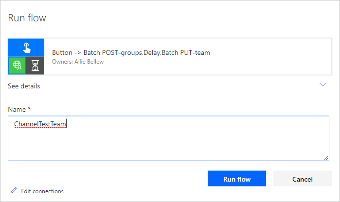
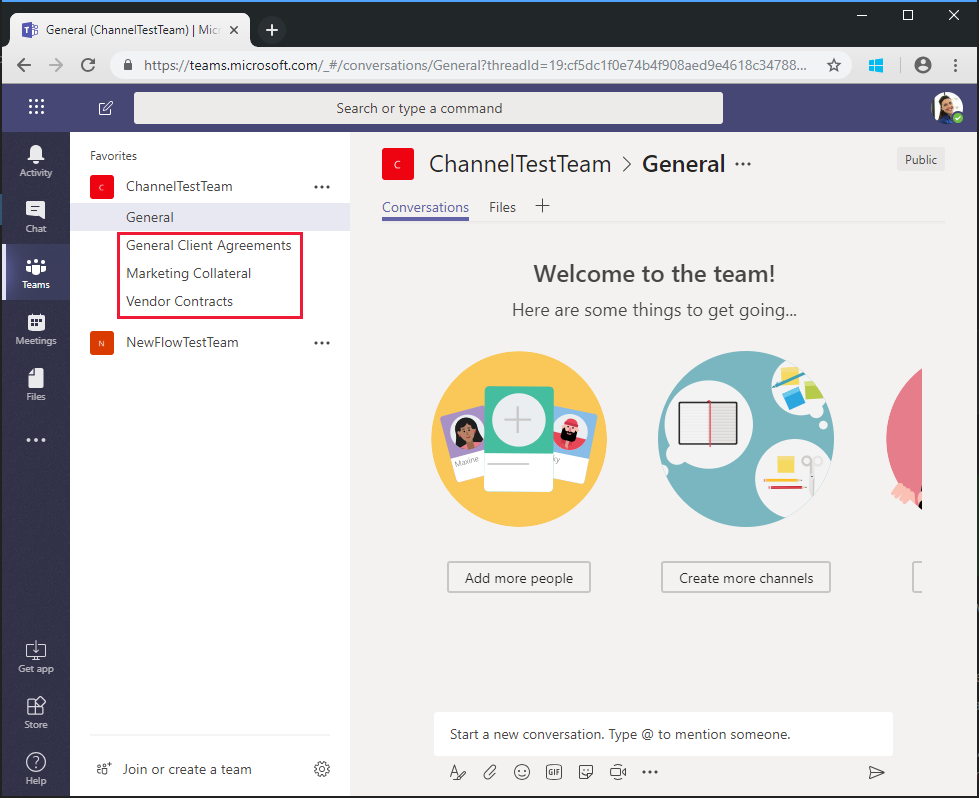

<!-- markdownlint-disable MD002 MD041 -->

<span data-ttu-id="7d248-101">Der in der vorherigen Übung erstellte Fluss verwendet die `$batch` API, um zwei einzelne Anforderungen an Microsoft Graph zu stellen.</span><span class="sxs-lookup"><span data-stu-id="7d248-101">The Flow you created in the previous exercise uses the `$batch` API to make two individual requests to the Microsoft Graph.</span></span> <span data-ttu-id="7d248-102">Das Aufrufen `$batch` des Endpunkts auf diese Weise bietet einige Vorteile und Flexibilität, aber die `$batch` wahre Leistungsfähigkeit des Endpunkts kommt beim Ausführen mehrerer Anforderungen `$batch` an Microsoft Graph in einem einzelnen Aufruf.</span><span class="sxs-lookup"><span data-stu-id="7d248-102">Calling the `$batch` endpoint this way provides some benefit and flexibility, but the true power of the `$batch` endpoint comes when executing multiple requests to Microsoft Graph in a single `$batch` call.</span></span> <span data-ttu-id="7d248-103">In dieser Übung erweitern Sie das Beispiel für das Erstellen einer einheitlichen Gruppe und das Zuordnen eines Teams zum Erstellen mehrerer Standardkanäle für das Team in einer einzigen `$batch` Anforderung.</span><span class="sxs-lookup"><span data-stu-id="7d248-103">In this exercise, you will extend the example of creating a Unified Group and associating a Team to include creating multiple default Channels for the Team in a single `$batch` request.</span></span>

<span data-ttu-id="7d248-104">Öffnen Sie [Microsoft Flow](https://flow.microsoft.com) in Ihrem Browser, und melden Sie sich mit Ihrem Office 365-mandantenadministrator Konto an.</span><span class="sxs-lookup"><span data-stu-id="7d248-104">Open [Microsoft Flow](https://flow.microsoft.com) in your browser and sign in with your Office 365 tenant administrator account.</span></span> <span data-ttu-id="7d248-105">Wählen Sie den Flow aus, den Sie im vorherigen Schritt erstellt haben, und klicken Sie auf **Bearbeiten**.</span><span class="sxs-lookup"><span data-stu-id="7d248-105">Select the Flow you created in the previous step and choose **Edit**.</span></span>

<span data-ttu-id="7d248-106">Wählen Sie **neuer Schritt** aus `Batch` , und geben Sie in das Suchfeld ein.</span><span class="sxs-lookup"><span data-stu-id="7d248-106">Choose **New step** and type `Batch` in the search box.</span></span> <span data-ttu-id="7d248-107">Fügen Sie die Batch-Konnektor-Aktion **MS Graph** hinzu.</span><span class="sxs-lookup"><span data-stu-id="7d248-107">Add the **MS Graph Batch Connector** action.</span></span> <span data-ttu-id="7d248-108">Wählen Sie die Auslassungspunkte aus, `Batch POST-channels`und benennen Sie diese Aktion in um.</span><span class="sxs-lookup"><span data-stu-id="7d248-108">Choose the ellipsis and rename this action to `Batch POST-channels`.</span></span>

<span data-ttu-id="7d248-109">Fügen Sie den folgenden Code in \*\*\*\* das Textfeld Text der Aktion ein.</span><span class="sxs-lookup"><span data-stu-id="7d248-109">Add the following code into the **body** text box of the action.</span></span>

```json
{
  "requests": [
    {
      "id": 1,
      "url": "/teams/REPLACE/channels",
      "headers": {
        "Content-Type": "application/json"
      },
      "method": "POST",
      "body": {
        "displayName": "Marketing Collateral",
        "description": "Marketing collateral and documentation."
      }
    },
    {
      "id": 2,
      "dependsOn": [
        "1"
      ],
      "url": "/teams/REPLACE/channels",
      "headers": {
        "Content-Type": "application/json"
      },
      "method": "POST",
      "body": {
        "displayName": "Vendor Contracts",
        "description": "Vendor documents, contracts, agreements and schedules."
      }
    },
    {
      "id": 3,
      "dependsOn": [
        "2"
      ],
      "url": "/teams/REPLACE/channels",
      "headers": {
        "Content-Type": "application/json"
      },
      "method": "POST",
      "body": {
        "displayName": "General Client Agreements",
        "description": "General Client documents and agreements."
      }
    }
  ]
}
```

<span data-ttu-id="7d248-110">Beachten Sie, dass die drei obigen Anforderungen die [dependsOn](https://docs.microsoft.com/graph/json-batching#sequencing-requests-with-the-dependson-property) -Eigenschaft verwenden, um eine Sequenzreihenfolge anzugeben, und jede eine Post-Anforderung ausführt, um einen neuen Kanal im neuen Team zu erstellen.</span><span class="sxs-lookup"><span data-stu-id="7d248-110">Notice the three requests above are using the [dependsOn](https://docs.microsoft.com/graph/json-batching#sequencing-requests-with-the-dependson-property) property to specify a sequence order, and each will execute a POST request to create a new channel in the new Team.</span></span>

<span data-ttu-id="7d248-111">Wählen Sie die `REPLACE` einzelnen Instanzen des Platzhalters aus, und wählen Sie dann im dynamischen Inhaltsbereich **Ausdruck** aus.</span><span class="sxs-lookup"><span data-stu-id="7d248-111">Select each instance of the `REPLACE` placeholder, then select **Expression** in the dynamic content pane.</span></span> <span data-ttu-id="7d248-112">Fügen Sie die folgende Formel in den **Ausdruck**ein.</span><span class="sxs-lookup"><span data-stu-id="7d248-112">Add the following formula into the **Expression**.</span></span>

```js
body('Batch_PUT-team').responses[0].body.id
```


<span data-ttu-id="7d248-114">Klicken Sie auf **Speichern**, und wählen Sie dann **Testen** aus, um den Fluss auszuführen.</span><span class="sxs-lookup"><span data-stu-id="7d248-114">Choose **Save**, then choose **Test** to execute the Flow.</span></span> <span data-ttu-id="7d248-115">Aktivieren Sie das Optionsfeld **Ich werde den Auslöser ausführen** , und wählen Sie dann **& Test speichern**aus.</span><span class="sxs-lookup"><span data-stu-id="7d248-115">Select the **I'll perform the trigger** action radio button, then choose **Save & Test**.</span></span> <span data-ttu-id="7d248-116">Geben Sie im Feld **Name** einen eindeutigen Gruppennamen ohne Leerzeichen ein, und wählen Sie **Flow ausführen** aus, um den Fluss auszuführen.</span><span class="sxs-lookup"><span data-stu-id="7d248-116">Enter a unique group name in the **Name** field without spaces, and choose **Run flow** to execute the Flow.</span></span>



<span data-ttu-id="7d248-118">Nachdem der Fluss gestartet wurde, wählen Sie den Link **Fluss Laufaktivität anzeigen** aus, und wählen Sie dann den ausgeführten Fluss aus, um das Aktivitätsprotokoll anzuzeigen.</span><span class="sxs-lookup"><span data-stu-id="7d248-118">Once the Flow starts, choose the **See flow run activity** link, then choose the running Flow to see the activity log.</span></span>

<span data-ttu-id="7d248-119">Nach Abschluss des Flusses hat die endgültige Ausgabe für die `Batch POST-channels` Aktion eine 201 HTTP-Status Antwort für jeden erstellten Kanal.</span><span class="sxs-lookup"><span data-stu-id="7d248-119">When the Flow completes, the final output for the `Batch POST-channels` action has a 201 HTTP Status response for each Channel created.</span></span>


<span data-ttu-id="7d248-121">Wechseln Sie zu [Microsoft Teams](https://teams.microsoft.com) , und melden Sie sich mit Ihrem Office 365-mandantenadministrator Konto an.</span><span class="sxs-lookup"><span data-stu-id="7d248-121">Browse to [Microsoft Teams](https://teams.microsoft.com) and sign in with your Office 365 tenant administrator account.</span></span> <span data-ttu-id="7d248-122">Stellen Sie sicher, dass das soeben erstellte Team angezeigt wird und die drei von der `$batch` Anforderung erstellten Kanäle enthält.</span><span class="sxs-lookup"><span data-stu-id="7d248-122">Verify that the team you just created appears and includes the three channels created by the `$batch` request.</span></span>



<span data-ttu-id="7d248-124">Während die obige `Batch POST-channels` Aktion in diesem Lernprogramm als separate Aktion implementiert wurde, konnten die Aufrufe zum Erstellen der Kanäle als zusätzliche Aufrufe in der `Batch PUT-team` Aktion hinzugefügt worden sein.</span><span class="sxs-lookup"><span data-stu-id="7d248-124">While the above `Batch POST-channels` action was implemented in this tutorial as a separate action, the calls to create the channels could have been added as additional calls in the `Batch PUT-team` action.</span></span> <span data-ttu-id="7d248-125">Dies hätte das Team und alle Kanäle in einem einzigen Batch Aufruf erstellt.</span><span class="sxs-lookup"><span data-stu-id="7d248-125">This would have created the Team and all Channels in a single batch call.</span></span> <span data-ttu-id="7d248-126">Probieren Sie es selbst aus.</span><span class="sxs-lookup"><span data-stu-id="7d248-126">Give that a try on your own.</span></span>

<span data-ttu-id="7d248-127">Denken Sie daran, dass [JSON-Batch](https://docs.microsoft.com/graph/json-batching) Aufrufe einen HTTP-Statuscode für jede Anforderung zurückgeben.</span><span class="sxs-lookup"><span data-stu-id="7d248-127">Finally, remember that [JSON Batching](https://docs.microsoft.com/graph/json-batching) calls will return an HTTP status code for each request.</span></span> <span data-ttu-id="7d248-128">In einem Produktionsprozess kann es sinnvoll sein, die Nachbearbeitung der Ergebnisse mit einer [`Apply to each`](https://docs.microsoft.com/flow/apply-to-each) Aktion zu kombinieren und jede einzelne Antwort mit einem 201-Statuscode zu validieren oder andere Statuscodes zu kompensieren.</span><span class="sxs-lookup"><span data-stu-id="7d248-128">In a production process, you may want to combine post processing of the results with an [`Apply to each`](https://docs.microsoft.com/flow/apply-to-each) action and validate each individual response has a 201 status code or compensate for any other status codes received.</span></span>